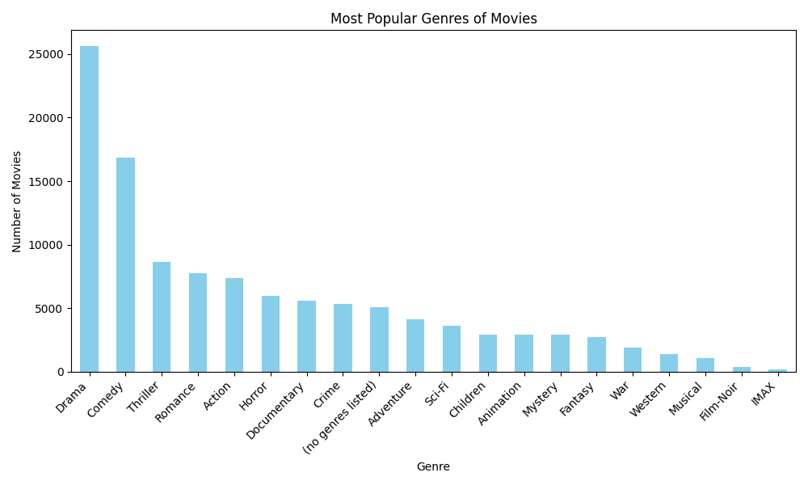

# Most Popular Genres of Movies

Here are the most popular genres of movies based on the analysis of the dataset:

1. **Top Genres**:
1. Drama: 25606.0 movies
2. Comedy: 16870.0 movies
3. Thriller: 8654.0 movies
4. Romance: 7719.0 movies
5. Action: 7348.0 movies
6. Horror: 5989.0 movies
7. Documentary: 5605.0 movies
8. Crime: 5319.0 movies
9. (no genres listed): 5062.0 movies
10. Adventure: 4145.0 movies
11. Sci-Fi: 3595.0 movies
12. Children: 2935.0 movies
13. Animation: 2929.0 movies
14. Mystery: 2925.0 movies
15. Fantasy: 2731.0 movies
16. War: 1874.0 movies
17. Western: 1399.0 movies
18. Musical: 1054.0 movies
19. Film-Noir: 353.0 movies
20. IMAX: 195.0 movies

## Genre Popularity Chart

