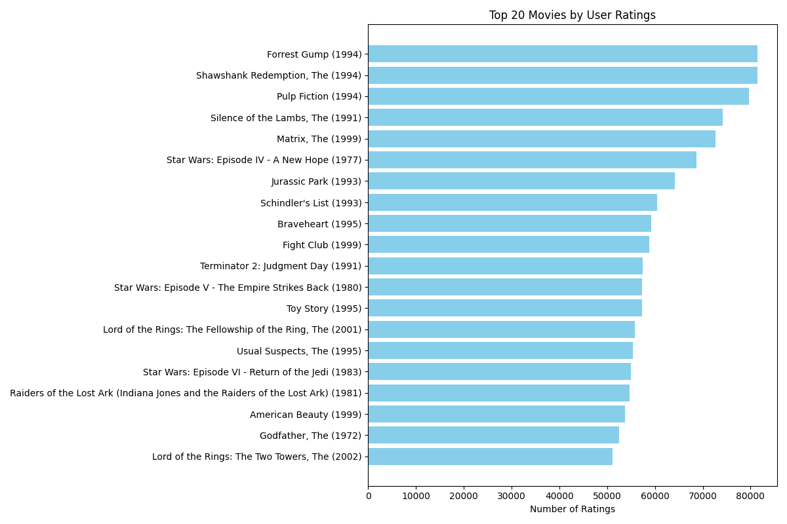

# Top 20 Movies by User Ratings

Here are the top 20 movies based on the highest number of user ratings and highest ratings:



```
                                                title  userId    rating
0                                 Forrest Gump (1994)   81491  4.048011
1                    Shawshank Redemption, The (1994)   81482  4.413576
2                                 Pulp Fiction (1994)   79672  4.188912
3                    Silence of the Lambs, The (1991)   74127  4.151342
4                                  Matrix, The (1999)   72674  4.154099
5           Star Wars: Episode IV - A New Hope (1977)   68717  4.120189
6                                Jurassic Park (1993)   64144  3.679175
7                             Schindler's List (1993)   60411  4.247579
8                                   Braveheart (1995)   59184  4.002273
9                                   Fight Club (1999)   58773  4.228311
10                  Terminator 2: Judgment Day (1991)   57379  3.946374
11  Star Wars: Episode V - The Empire Strikes Back...   57361  4.144122
12                                   Toy Story (1995)   57309  3.893708
13  Lord of the Rings: The Fellowship of the Ring,...   55736  4.091189
14                         Usual Suspects, The (1995)   55366  4.284353
15  Star Wars: Episode VI - Return of the Jedi (1983)   54917  3.996513
16  Raiders of the Lost Ark (Indiana Jones and the...   54675  4.123923
17                             American Beauty (1999)   53689  4.107340
18                              Godfather, The (1972)   52498  4.324336
19      Lord of the Rings: The Two Towers, The (2002)   51138  4.068051
```
